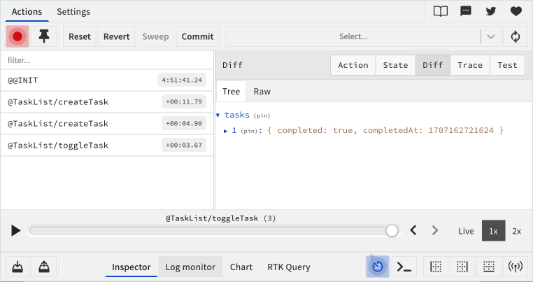

# Atomic To-Do List
## Coding Challenge: Createa a To-Do List app using **Atomic Design** and **Typescript**

Read the [complete project requirements](requirements.md).

The app should have the following features:
#### Basic Requirements:
- [x] Add a new task
- [x] Mark a task as completed
- [x] Remove completed tasks
- [x] Filter tasks by status 
- [x] Responsive layout
- [x] Automated tests
- [x] Documentation

#### Bonus: 
  - [x] Persist tasks in local storage
  - [x] Linting and code formatting
  - [x] Edit task name
  - [x] Animations or transitions
  - [x] Test coverage

##### Other:
  - Fake user authentication
  - Side menu with extra settings
  - Custom components built with [styled-components](https://styled-components.com/)
  - Custom `light`, `dark` and `olive` themes.
  - Custom linter rules using [eslint](https://eslint.org/)
  - Custom illustrations with [unDraw](https://undraw.co/illustrations) and [figma](https://www.figma.com/)
  - Custom icons with [Lucid Icons](https://lucide.dev/)
  - Deployment with GithubPages at [ivanifj.github.io/todo-list](https://ivanifj.github.io/todo-list/)
  - Keyboard friendly with accessible elements

## Development
### Running locally
In order to run the application, you must install [Node](https://nodejs.org/en/) with specified version on package.json.
It is recommended for you to use a version manager like [`nvm`](https://github.com/nvm-sh/nvm).
Then we need to install the package manager, we are using [`yarn`](https://yarnpkg.com/), we can do that by running `npm -i -g yarn` to make yarn available globally on your system.

```bash
# install the dependencies
yarn
# start the development server
yarn dev 
```

### Usefull commands

#### Running tests
```bash
yarn test
yarn test:watch
```

#### Build and serve the app
```bash
yarn build
yarn serve
``` 

#### Run Linter
```bash 
yarn lint
yarn lint --fix
``` 

#### Integration with DevTools
The app is integrated with Redux DevTools. You can [install the extension](https://chromewebstore.google.com/detail/redux-devtools/lmhkpmbekcpmknklioeibfkpmmfibljd) on your browser and see the state evolution with a time-travel debug.


